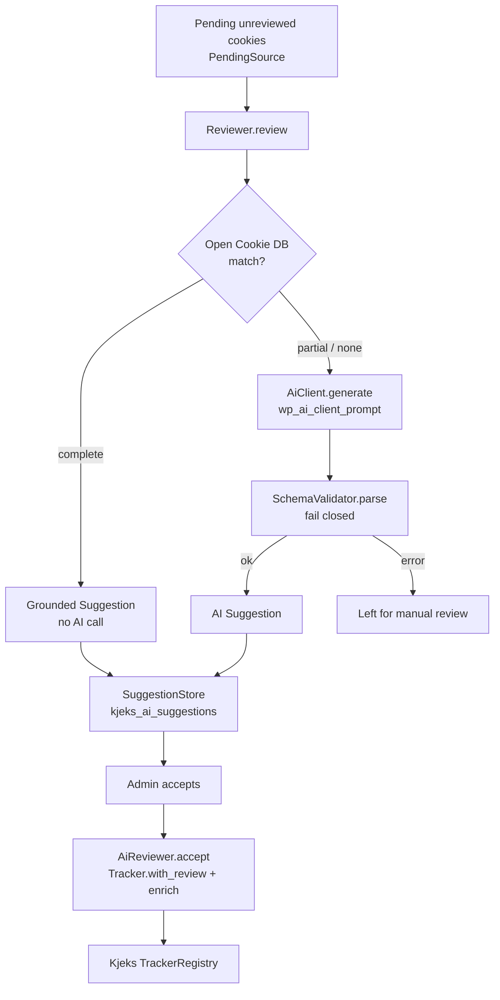

# Architecture

Kjeks AI Reviewer is a thin, advisory layer on top of the Kjeks registry. It
adds no data model of its own to Kjeks; it produces **suggestions** that an
administrator turns into normal Kjeks reviews.

## Control flow

## Components

| Class                       | Responsibility                                                        |
| --------------------------- | -------------------------------------------------------------------- |
| `Dependency`                | Gates on Kjeks presence and `wp_supports_ai()`.                      |
| `PendingSource`             | Yields unreviewed trackers from the Kjeks registry (batch-capped).   |
| `Grounding\OpenCookieDatabase` | Deterministic name/pattern/domain match against a pinned snapshot. |
| `AiClient`                  | Thin adapter over `wp_ai_client_prompt()->generate_text()`.          |
| `SchemaValidator`           | Parses and validates model JSON; fails closed.                       |
| `CategoryMap`               | Maps free-form labels to the four Kjeks categories.                  |
| `Reviewer`                  | Ground-before-generate for one tracker → a `Suggestion` or error.    |
| `AiReviewer`                | Batch orchestration; accept/reject; enrichment on accept.            |
| `Suggestion` / `SuggestionStore` | Value object and its own network-option store (separate from the registry). |
| `Cron`                      | Optional opt-in weekly pass.                                          |
| `Rest\SuggestController` / `Rest\AcceptController` | `kjeks-ai/v1` endpoints (`manage_network`). |
| `Admin\ReviewerTab`         | Enqueues the React bundle that registers the tab via `kjeks.networkAdminTabs`. |

## Boundaries

- **Advisory only.** A `Suggestion` never carries the reviewed flag. Only
  `AiReviewer::accept()` writes to the registry, and only via
  `Tracker::with_review()`.
- **Never necessary by default.** Unmapped categories and low-confidence
  answers resolve to `marketing` or are rejected — never silently `necessary`.
- **Separate storage.** Suggestions live in `kjeks_ai_suggestions`, decoupled
  from the registry so generation has no side effects on classification.
- **Graceful absence.** Without Kjeks, the plugin only shows an admin notice.
  Without AI support, the tab and generation endpoints stand down.

See the [ADRs](adr/) for the reasoning behind these boundaries.
